# Frontend Mentor - Insure landing page solution

This is a solution to the [Insure landing page challenge on Frontend Mentor](https://www.frontendmentor.io/challenges/insure-landing-page-uTU68JV8). Frontend Mentor challenges help you improve your coding skills by building realistic projects. 

## Table of contents

- [Overview](#overview)
  - [The challenge](#the-challenge)
  - [Screenshot](#screenshot)
  - [Links](#links)
- [My process](#my-process)
  - [Built with](#built-with)
  - [What I learned](#what-i-learned)
  - [Continued development](#continued-development)
  - [Useful resources](#useful-resources)
- [Author](#author)
- [Acknowledgments](#acknowledgments)


## Overview

### The challenge

Users should be able to:

- View the optimal layout for the site depending on their device's screen size
- See hover states for all interactive elements on the page

### Screenshot

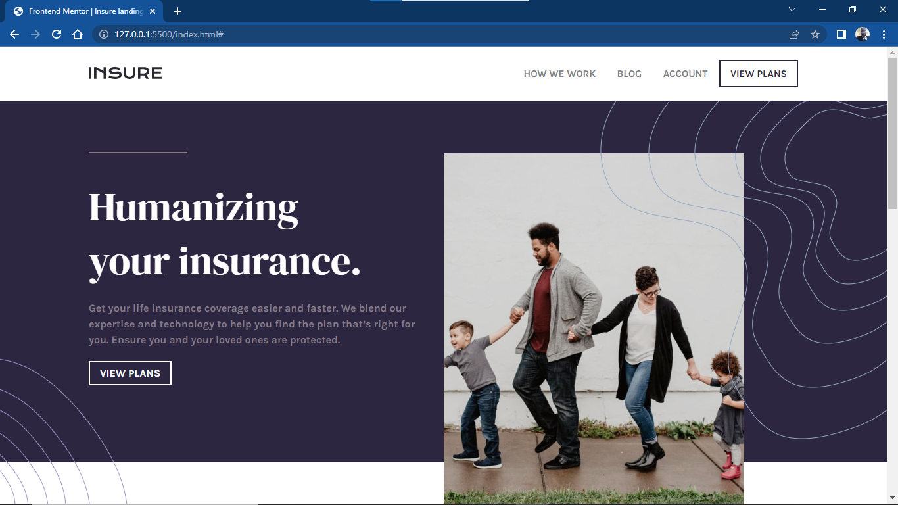
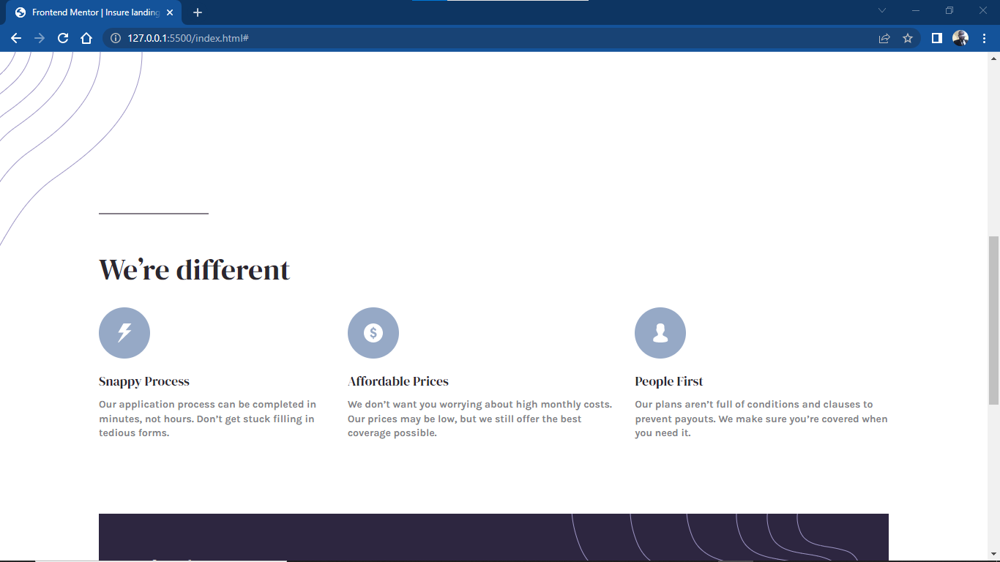
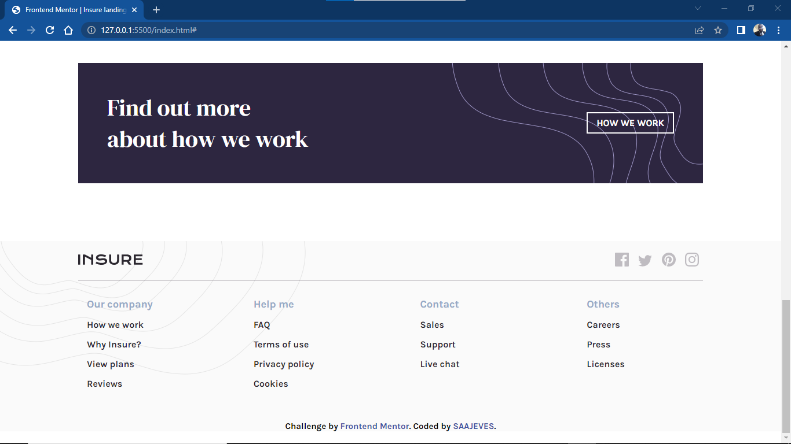
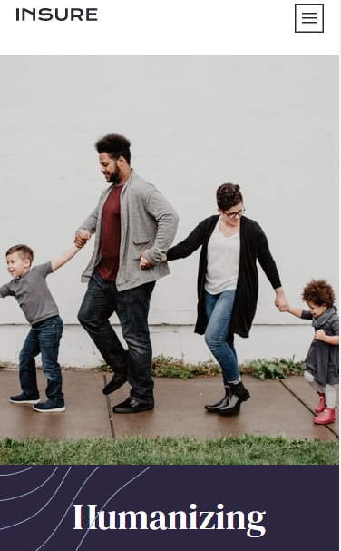
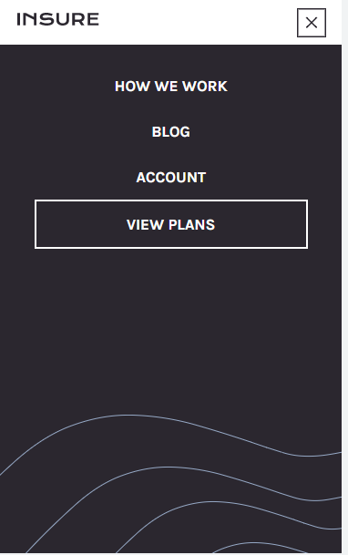
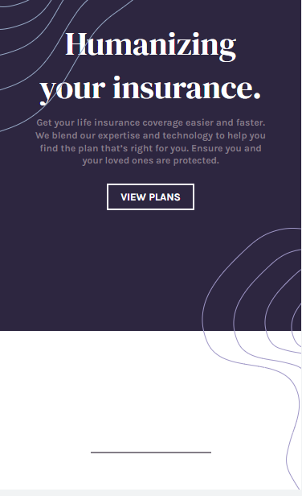
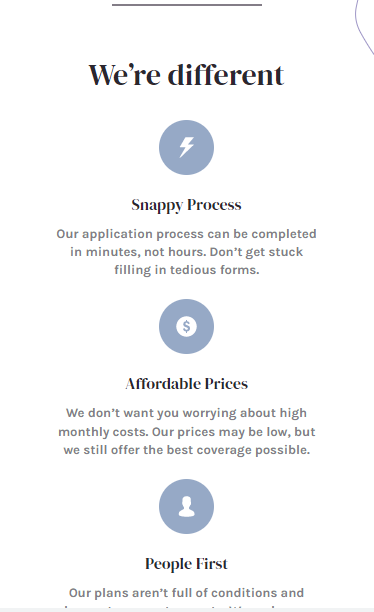
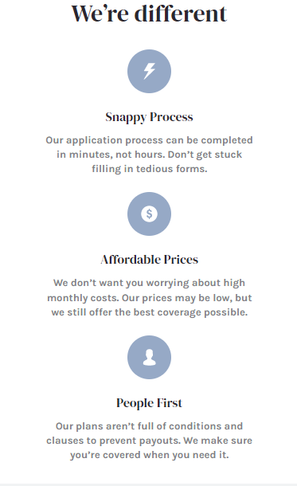
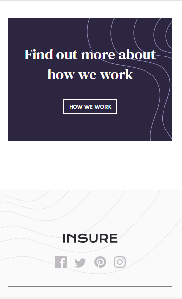
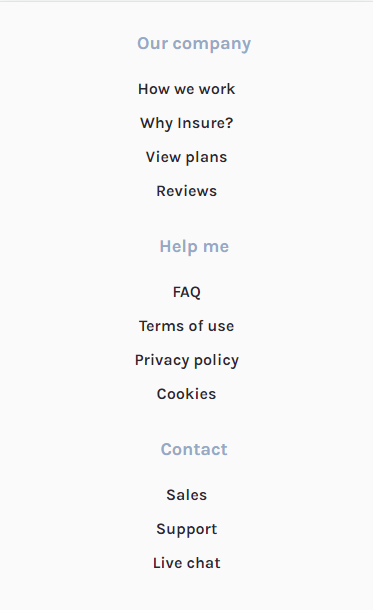
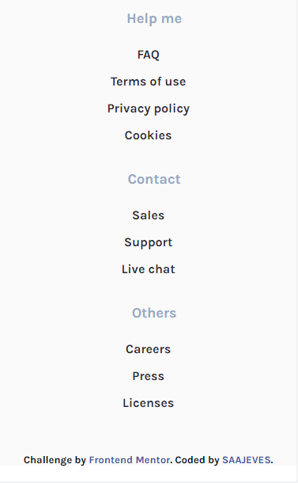


### Links

- Solution URL: [www.saajevessolutionforthisproject.com](https://github.com/SAAJEVES/FrontendMentor-challenge-on-JS-J05)
- Live Site URL: [www.saajeveslivesiteforthisproject.com](https://saajeves.github.io/FrontendMentor-challenge-on-JS-J05/)

## My process

### Built with

- Semantic HTML5 markup
- CSS custom properties
- Flexbox


### What I learned

Paying attentions to details is paramount and also following laid down guidelines on codes should be strictly adhered to. COncerning making my nav-bar transitioning from height of zero to maximum height using JS, I went through a lot of brain racking scenes try to make the transitioning work

```js
function openLinks() {
    closeLinksBtn.style.display = "block";
    linksContainer.classList.add("height");
}
```

```css
.header-links.height {
  height: 100%;
}
```

```css
.header-links.height {
  height: max-content;
}
```
```css
.header-links {
  height: 0%;
  width: 100%;
  position: fixed;
  left: 0%;
  top: 50px;
  z-index: 123;
  overflow: hidden;
  transition-duration: 400ms;
}
```
Using the first css styling where the height is set to "100%", transitioning (animation) will work fine when added to the third css styling.
Using the second css styling where the height is set to "max-content", transitioning (animation) will not work when added to the third css styling.
So, the difference for the transitioning to work was using "100%" instead of "max-content". And I never considered it as a big deal.


### Continued development

Still have a long way to go, so continued development should be all round ie html, css and JS. After working on this project, I felt that my css styling was too much and I could have done more to write shorter css styling than this written. Better luck to me in my next frontend mentor project.

### Useful resources

A lot of resources was helpful not just in this project but from the beginning of my learning of web development.
- [w3schools](https://www.w3schools.com) 

- [freecodecamp](https://www.freecodecamp.com)

- [youtube](https://www.youtube.com)

- And lots more. Surely, I will always recommend them days in and days out


## Author

- Github - [go to my github account](https://github.com/SAAJEVES)
- Frontend Mentor - [go to my frontend mentor account](https://www.frontendmentor.io/profile/SAAJEVES)
- Twitter - [go to my twitter account](https://www.twitter.com/saajeves)
- LinkedIn - [go to my linkedin account](https://www.linkedin.com/in/samuel-ajagun-020283150)


## Acknowledgments

I would love to acknowledge [a very good friend of mine and mentor](https://github.com/wisdomosara) for his immense contribution on helping me in this project. You are well appreciated.